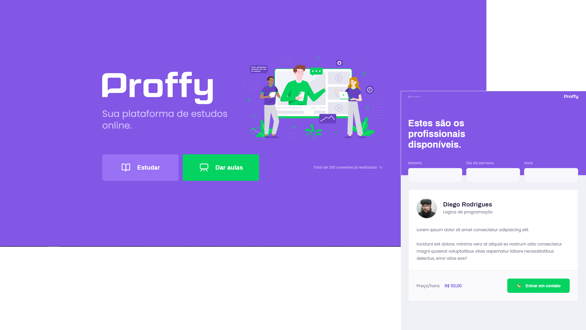

# NLW2
Next level week #2


</img>
<h1 align="center">Next Level Week II</h1>
<p align="center">Projeto <strong>Proffy</strong> desenvolvido durante o Rocketseat Next Level Week II.
  <br/>
O projeto consiste em professores que oferecem aulas aos alunos, nas mais diversas disciplinas. O aluno tem informações sobre o preço do professor, detalhes de contato e contratos por seus serviços.
</p>

<!-- <p align="center">
  <a aria-label="NodeJs version" href="https://github.com/nodejs/node/blob/master/doc/changelogs/CHANGELOG_V12.md#12.14.1">
    </img>
  </a>
  <a aria-label="ReactJs version" href="https://github.com/facebook/react/blob/master/CHANGELOG.md#16120-november-14-2019">
    </img>
  </a>
</p> -->
<h1 align="center">
  </img>
  <p align="center"> <strong></strong>Trabalho em progresso... </p>
</h1>

## Instalation
Para instalar as dependências e executar o **Frontend** , clone o projeto no seu computador e execute:
```bash
cd web
yarn install
yarn start
```

## Frontend

</img>

Para executar o Frontend do React, use:
```bash
cd web
yarn start
```
Quando o processo terminar, abrirá automaticamente a página localhost:3000no seu navegador da Web com o Project Proffy.


## Licença

[MIT](./LICENSE) &copy; [Rocketseat](https://rocketseat.com.br/)

Feito com ♥ por Diego Rodrigues :wave: [Entrar em contato!](https://www.linkedin.com/in/diego-rodrigues-14925850/)
